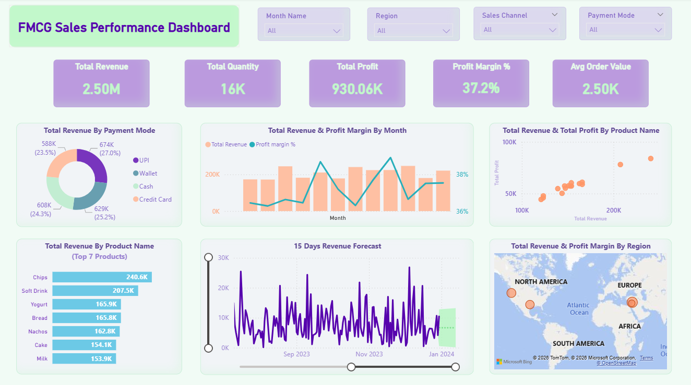

# 📊 FMCG Sales Performance & Revenue Forecasting Dashboard

An end-to-end interactive Power BI dashboard designed to analyze sales performance, regional revenue distribution, profitability, and 15-day revenue forecasting for a Fast-Moving Consumer Goods (FMCG) dataset.

---

## 📌 Executive Summary

This interactive dashboard enables sales leadership and financial analysts to monitor key revenue metrics, optimize product mix, evaluate payment channels, and accurately anticipate short-term demand through time-series forecasting.

---

## 🎯 Key Features & Insights

* **Executive KPIs:** Tracks critical business metrics including **Total Revenue ($2.50M)**, **Total Quantity Sold (16K)**, **Total Profit ($930.06K)**, **Profit Margin (37%)**, and **Average Order Value ($2.50K)**.
* **15-Day Revenue Forecast:** Employs predictive analytics to project sales trends and help management optimize inventory and resource allocation.
* **Product Performance Analysis:** Highlights top-performing products (led by *Chips* and *Soft Drinks*) and maps product revenue against profitability via a Scatter Plot analysis.
* **Regional & Channel Breakdown:** Visualizes sales across global geographic regions (North America, Europe, Africa, etc.) and examines customer payment preferences (UPI, Credit Card, Wallet, Cash).
* **Interactive Slicers:** Allows deep-dive filtering by *Month*, *Region*, *Sales Channel*, and *Payment Mode*.

---

## 🛠️ Tools & Technologies Used

* **Business Intelligence:** Power BI Desktop
* **Data Transformation:** Power Query (ETL process, data cleaning & normalization)
* **Data Analysis Expression:** DAX (Custom Measures for Revenue, Profit Margin %, AOV, and Forecast)
* **Visualizations:** Custom Scatter Plots, Donut Charts, Geographic Maps, and Line/Clustered Column Charts

---

